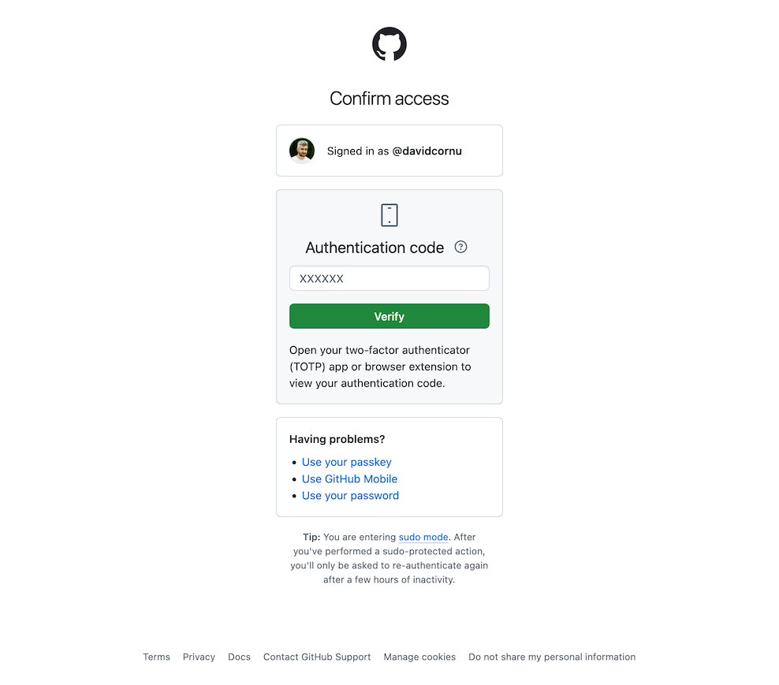
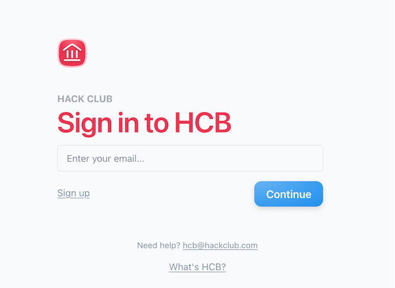
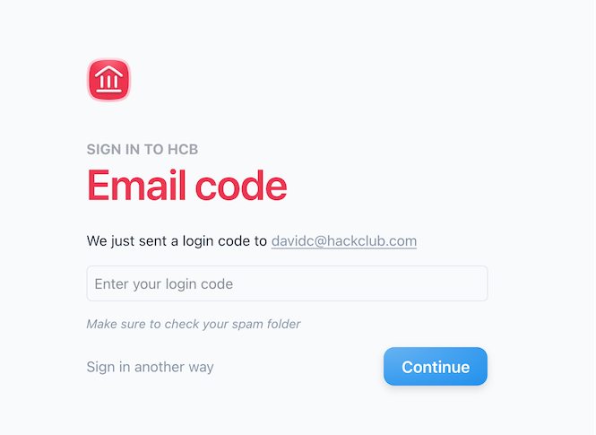
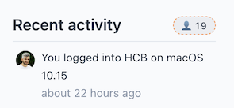
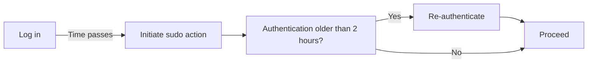
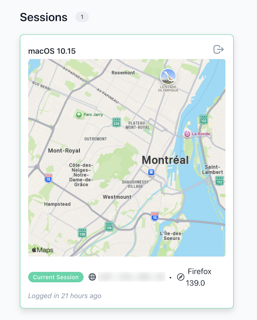
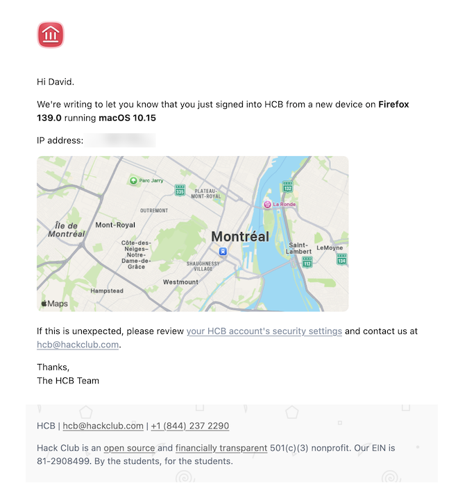

# RFC 1: Sudo Mode

## What problem are we solving?

https://github.com/hackclub/hcb/issues/6346

User sessions remain active for long periods of time (30 days by default), which increases the risk of a third-party gaining access to their browser and performing potentially dangerous actions without needing to re-authenticate.

To mitigate this we want to implement a process similar to GitHub's [sudo mode][sudo mode], which requires users to re-authenticate when performing specific actions if they haven't already done so in the last 2 hours.

[sudo mode]: https://docs.github.com/en/authentication/keeping-your-account-and-data-secure/sudo-mode#about-sudo-mode

## How does authentication work today?

### Login flow

1. Users visit `/users/auth` where they `POST` a form containing an `email` field to `/logins`

   
2. This creates a `Login` record whose `id` is used to tie together subsequent actions: https://github.com/hackclub/hcb/blob/8508ac95625ca08aef11b7919596ddb8f68c0665/app/controllers/logins_controller.rb#L26-L46
3. Based on user preferences and the availability of `WebAuthn`, `LoginsController` drives the state machine in the `Login` model to determine what steps are required by the user and process authentication attempts (submitted to the `/logins/:id/complete` endpoint).

   
4. Once the `Login` is considered complete, we create an associated `UserSession` record: https://github.com/hackclub/hcb/blob/8508ac95625ca08aef11b7919596ddb8f68c0665/app/controllers/logins_controller.rb#L149
5. When the user logs out we populate `UserSession#signed_out_at` and set `expiration_at` to now https://github.com/hackclub/hcb/blob/8508ac95625ca08aef11b7919596ddb8f68c0665/app/helpers/sessions_helper.rb#L134-L142 

### Session storage

- `UserSession` records have a `session_token` property which is stored encrypted alongside its hash https://github.com/hackclub/hcb/blob/d293e57763729f69a1612606e22095761650eccd/db/schema.rb#L2140-L2141 using the [`blind_index` gem](https://github.com/ankane/blind_index).
- This session token is stored in an encrypted cookie https://github.com/hackclub/hcb/blob/8508ac95625ca08aef11b7919596ddb8f68c0665/app/helpers/sessions_helper.rb#L25-L49 allowing us to retrieve the `UserSession` on subsequent requests https://github.com/hackclub/hcb/blob/8508ac95625ca08aef11b7919596ddb8f68c0665/app/helpers/sessions_helper.rb#L107-L116
- The session duration is determined by `User#session_duration_seconds` which defaults to 30 days https://github.com/hackclub/hcb/blob/d293e57763729f69a1612606e22095761650eccd/db/schema.rb#L2173
  - This value is user-configurable from a pre-defined set of options https://github.com/hackclub/hcb/blob/ad940d9b29be634ff412b6f88f1a8e58bb624444/app/views/users/edit.html.erb#L222-L225
  - We don't currently validate this value (see https://github.com/hackclub/hcb/pull/10660)
  - When a session is created we compute the expiry time using this value and set it on both the cookie and `UserSession` https://github.com/hackclub/hcb/blob/8508ac95625ca08aef11b7919596ddb8f68c0665/app/helpers/sessions_helper.rb#L28
- The session duration is fixed upon creation and isn't affected by user activity. There is interest in changing this: https://github.com/hackclub/hcb/issues/7258
  - We do however update `UserSession#last_seen_at` on every request https://github.com/hackclub/hcb/blob/8508ac95625ca08aef11b7919596ddb8f68c0665/app/controllers/application_controller.rb#L21-L22
- We don't currently clear out older sessions but this may be something worth looking into ([internal discussion](https://hackclub.slack.com/archives/C047Y01MHJQ/p1750259883680629)).
- `UserSession` creation is tracked using the [`public_activity` gem](https://github.com/public-activity/public_activity) so it can be displayed under "Recent activity"

    
    
    This is configured here https://github.com/hackclub/hcb/blob/cbfccf8975fd8a9c258f916034ef8e7836e80229/app/models/user_session.rb#L47-L48 and displayed here https://github.com/hackclub/hcb/blob/d293e57763729f69a1612606e22095761650eccd/app/controllers/my_controller.rb#L6-L13

## Design considerations

> [!NOTE]
> We will assume a user is in sudo mode if they are logged in and last authenticated less than 2 hours ago

**Assumptions**

1. Users who initiate a sudo action and subsequently abandon it (e.g. because they don't have access to their email or TOTP) should remain logged in.
2. Re-authentication only requires a single factor of the user's choosing
3. Once they are re-authenticated we won't require them to do so for another two hours

**Open questions**

1. We currently show users a list of their sessions including how long ago they logged in. Should we also surface information about re-authentications?

   
2. We send users an email when there is a new login on their account. Would we want to do the same for re-authentications?

   
3. How do we want to handle sudo actions for users that are being impersonated? Is re-authenticating the impersonator enough?
    - _Opinion_: We should strongly consider making this question go away by capping impersonated sessions to 2 hours. I don't think there's a use case for having these persist for longer than that. 
4. Should re-authentications appear in activities?
5. How should this work within https://github.com/hackclub/hcb-mobile? Should we return a known error code so the mobile app can prompt the user to re-authenticate?

### How do we model the re-authentication?

**Option 1 - Treat it as a new `Login`**

Given that we have an existing flow for authenticating users, we could treat re-authentication as a new login flow which, once complete, swaps in a new `UserSession`.

We would ideally link the new `Login` to the previous one so we can distinguish it as a re-authentication, apply different rules (e.g. only requiring one factor), and maintain a chain of `Login` records (for auditing purposes).

**Option 2 - Model re-authentications separately**

Rather than overload the concept of a login, we could introduce something like `ReAuthentication` of which `UserSession` would have 0 or more.

This would require similar but more straightforward logic to `Login` (given that there's only one factor required) and store similar metadata to `UserSession` so we have an audit trail (e.g. if you re-authenticate 28 days into your session from a completely different side of the world we may want to know about that).

### UX

1. We need to introduce an additional step to specific actions, ideally with as little code duplication as necessary.
   1. Maybe there's a good way to model this at the controller-level (https://github.com/markets/sudo_rails might prove inspiring)
   2. For actions that don't need to carry additional context around (e.g. view this page), it may be sufficient to use redirects
   3. For actions that carry context (e.g. set this attribute to a value) we'll have to do some experimentation
2. We need to display the reauthentication form (which could be multi-step in the case of email) between the action being initiated and completed.
   - Based on (1.iii) we'll know whether full page redirects are possible 
   - We may be able to leverage [turbo streams](https://turbo.hotwired.dev/handbook/streams) as well if we want the form to appear on the page itself. This might solve the context problem as we may be able to re-submit the same form.

> [!NOTE]
> We should prototype something here to help us make a more informed decision.